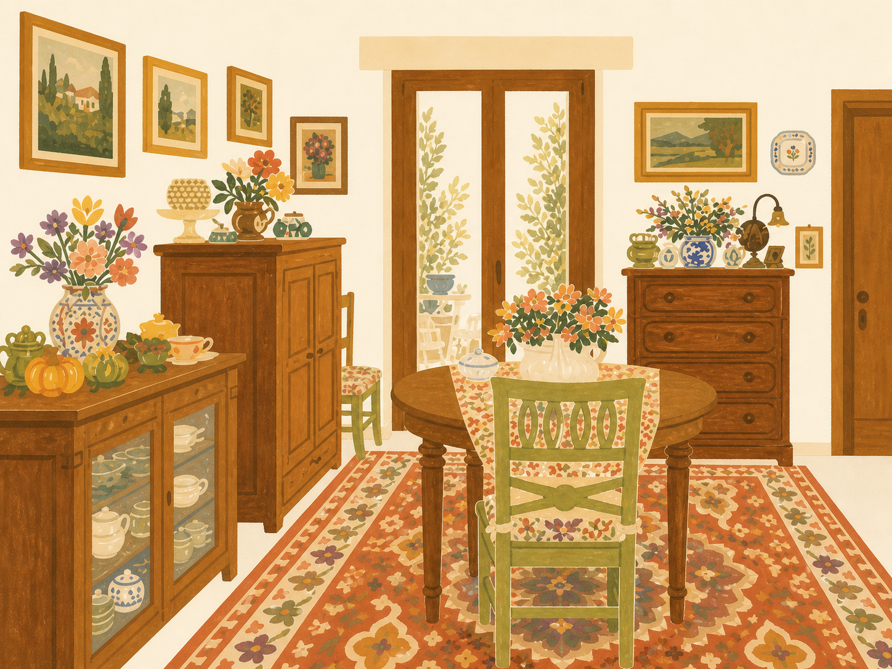

<p align="right">
  <a href="./README.md"></a>
  <a href="./README.zh-CN.md"></a>
</p>

# Make Journal Material Skill

> Turn travel, interior, still-life, and everyday photos into separate, cuttable, hand-painted journaling materials.

[](https://developers.openai.com/codex)


[](LICENSE)

`make-journal-material-skill` extracts memorable objects from a photo, redraws them in a consistent retro gouache and cut-paper style, and delivers a **16:9, 1920×1080 transparent PNG** material sheet.

## Preview

| Visual language | Example output |
| --- | --- |
|  |  |

> The image on the left defines only the rendering style, palette, and texture. The image on the right is a final transparent material sheet extracted and redrawn from a different everyday photo. The input photo and magenta chroma-key intermediate are neither published nor delivered.

## What it does

- Extracts nine representative object groups by default instead of reproducing a cluttered background.
- Compresses realistic lighting and perspective into flat, decorative folk-art gouache shapes.
- Preserves recognizable object identities while adding hand-drawn edges, paper grain, and decorative patterns.
- Removes the generation-stage chroma key and verifies the alpha channel automatically.
- Produces a fixed 1920×1080 RGBA PNG ready for journals, collages, and layouts.

## Quick start

### 1. Install

Download or clone the repository into your personal Codex Skills directory:

```bash
git clone https://github.com/EmmaCao1/make-journal-material-skill.git \
  ~/.codex/skills/make-journal-material-skill

python3 -m pip install -r \
  ~/.codex/skills/make-journal-material-skill/requirements.txt
```

If you use a Skill installer in Codex, you can simply ask:

```text
Install this Skill from https://github.com/EmmaCao1/make-journal-material-skill.
```

### 2. Use

Upload a photo, then say:

```text
Use $make-journal-material-skill to turn this photo into a 16:9 transparent PNG journaling material collection.
```

You can also name the objects you want to preserve:

```text
Use $make-journal-material-skill and prioritize the bird, coffee cups, round table, and stone-wall motifs.
```

## Output specification

| Item | Fixed rule |
| --- | --- |
| Canvas | Horizontal 16:9, 1920×1080 |
| File | PNG with a valid alpha channel |
| Quantity | Nine independent object groups by default |
| Layout | Loose 3×3 grid with generous cutting space, no overlap or cropping |
| Style | Retro gouache, folk art, cut-paper shapes, subtle paper grain |
| Background | Fully transparent; no wall, floor, cast shadow, or sticker border |
| Delivery | Final artwork only; chroma-key and failed intermediates stay hidden |

## How it works

```text
Input photo
  → Select memorable objects
  → Redraw with the bundled style reference
  → Generate a 16:9 chroma-key material sheet
  → Remove the key and clean the edges
  → Validate size, transparency, and visual quality
  → Deliver the transparent PNG
```

`SKILL.md` defines object selection, visual treatment, generation prompts, and delivery rules. `scripts/finalize_transparent_png.py` handles chroma-key removal, edge decontamination, size normalization, and transparency validation.

## Requirements

- The host must provide image-generation or image-editing capability. This repository does not include a model or API key.
- Post-processing requires Python 3 and Pillow, declared in `requirements.txt`.
- The Skill does not depend on the author's other local Skills, private folders, or Codex system scripts.
- `assets/style-reference.png` is the bundled visual anchor and is available immediately after installation.

## FAQ

### Why is there a magenta background during generation?

It is an internal chroma key that helps isolate objects reliably before post-processing converts it into transparency. The Skill explicitly prevents this intermediate from being shown or delivered to the user.

### Can I request fewer or more than nine object groups?

Yes. Nine is the default. You can specify another count and list mandatory objects, while still leaving enough cutting space around every motif.

### Will the final image really be transparent?

Yes. The delivered file must be a transparent PNG. Whether the generation host supports native transparency does not matter because the Skill includes a stable chroma-key post-processing workflow.

### Will my original photo be uploaded to this repository?

No. The repository does not store user input photos. How an image-generation service handles inputs depends on the host and service terms you use.

## Repository structure

```text
make-journal-material-skill/
├── README.md
├── README.zh-CN.md
├── SKILL.md
├── agents/openai.yaml
├── assets/
│   ├── style-reference.png
│   └── example-output.png
├── scripts/finalize_transparent_png.py
├── requirements.txt
└── LICENSE
```

## License

[MIT License](LICENSE) © EmmaCao1
