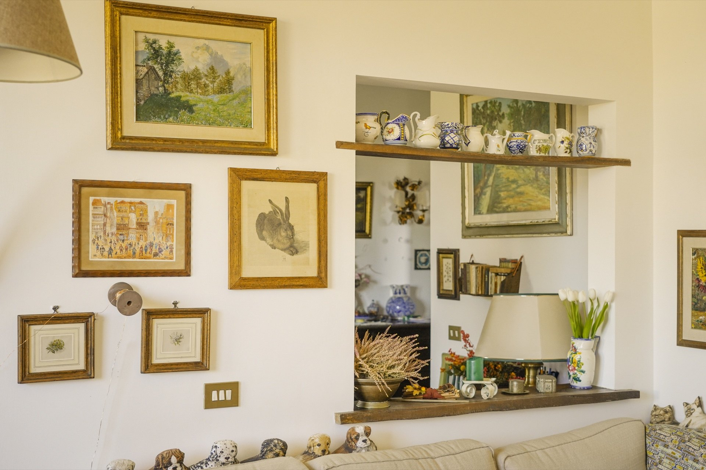
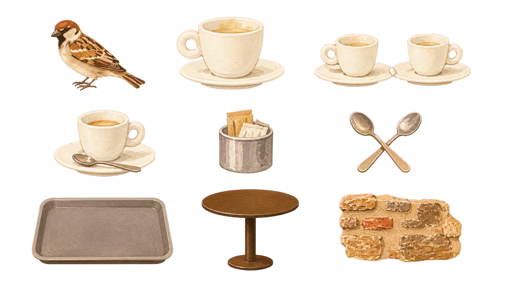

<p align="right">
  <a href="./README.md"></a>
  <a href="./README.zh-CN.md"></a>
</p>

# Make Journal Material Skill

> 把旅行、室内、静物与生活照片，变成可单独剪贴的复古手绘手帐素材合集。

[](https://developers.openai.com/codex)


[](LICENSE)

`make-journal-material-skill` 会从一张照片中提取有记忆点的物件，统一转绘成复古水粉剪纸风，并交付一张 **16:9、1920×1080、透明背景 PNG** 素材页。

## 效果预览

| 1 · 原始输入照片 | 2 · 对应生成的素材合集 |
| --- | --- |
|  |  |

> 这是一组对应的生成前后示例：左图是原始照片，右图中的物件均从这张照片中提取并重新绘制。洋红色键中间图不会展示或交付。

## 它会做什么

- 从照片中提取默认 9 组代表性物件，不照搬杂乱背景。
- 把真实光影和透视压缩成复古民间艺术式水粉色块。
- 保留物件辨识度，同时加入手绘边缘、纸张颗粒与装饰纹样。
- 自动去除生成阶段的色键背景，并检查透明通道。
- 固定输出为 1920×1080 的 RGBA PNG，方便在手帐、拼贴和排版中直接使用。

## 快速开始

### 1. 安装

把仓库下载或克隆到 Codex 的个人 Skills 目录：

```bash
git clone https://github.com/emmaCCdesign/make-journal-material-skill.git \
  ~/.codex/skills/make-journal-material-skill

python3 -m pip install -r \
  ~/.codex/skills/make-journal-material-skill/requirements.txt
```

如果你已经在 Codex 中使用 Skill 安装器，也可以直接说：

```text
请从 https://github.com/emmaCCdesign/make-journal-material-skill 安装这个 Skill。
```

### 2. 调用

上传一张照片，然后说：

```text
使用 $make-journal-material-skill，把这张照片制作成 16:9 透明 PNG 手帐素材合集。
```

你也可以补充想保留的物件：

```text
使用 $make-journal-material-skill，重点提取小鸟、咖啡杯、圆桌和石墙元素。
```

## 输出标准

| 项目 | 固定规则 |
| --- | --- |
| 画布 | 横向 16:9，1920×1080 |
| 文件 | PNG，带有效 Alpha 透明通道 |
| 数量 | 默认 9 组独立素材 |
| 排版 | 三行三列、间距宽松、无重叠和裁切 |
| 风格 | 复古水粉、民间艺术、剪纸色块、轻微纸张颗粒 |
| 背景 | 最终完全透明，不含墙面、地面、阴影或贴纸白边 |
| 交付 | 只展示最终成品，不向用户展示色键及失败中间图 |

## 工作方式

```text
输入照片
  → 选择具有记忆点的物件
  → 按内置风格参考转绘
  → 生成 16:9 色键素材页
  → 去色键与边缘净化
  → 尺寸、透明度与视觉检查
  → 交付透明 PNG
```

仓库内的 `SKILL.md` 负责物件选择、画面风格、生成提示词与交付规则；`scripts/finalize_transparent_png.py` 负责色键移除、边缘去色、尺寸规范化和透明度验证。

## 运行条件

- 宿主需要具备图片生成或图片编辑能力；本仓库不包含生成模型或 API 密钥。
- 后处理需要 Python 3 和 Pillow，依赖写在 `requirements.txt` 中。
- Skill 不依赖作者电脑上的其他 Skill、私人文件夹或 Codex 内部脚本。
- `assets/style-reference.png` 是随仓库发布的风格锚点，安装后即可使用。

## 常见问题

### 为什么生成过程中会有洋红背景？

它只是内部色键，用来稳定生成独立物件并在后处理中换成透明通道。Skill 规定不向用户展示或交付这个中间产物。

### 可以指定少于或多于 9 组素材吗？

可以。9 组是默认值；你可以在请求中指定数量和必须保留的物件，但仍建议保留足够剪裁间距。

### 能直接得到透明背景吗？

最终交付一定是透明 PNG。生成阶段是否原生透明由宿主能力决定；Skill 会使用色键后处理作为稳定方案。

### 会上传或公开我的原始照片吗？

不会。仓库本身不保存用户输入照片。图片生成服务如何处理输入，取决于你所使用的宿主与服务条款。

## 仓库结构

```text
make-journal-material-skill/
├── README.md
├── README.zh-CN.md
├── SKILL.md
├── agents/openai.yaml
├── assets/
│   ├── style-reference.png
│   ├── example-input.jpg
│   └── example-output.png
├── scripts/finalize_transparent_png.py
├── requirements.txt
└── LICENSE
```

## 许可证

[MIT License](LICENSE) © emmaCCdesign
